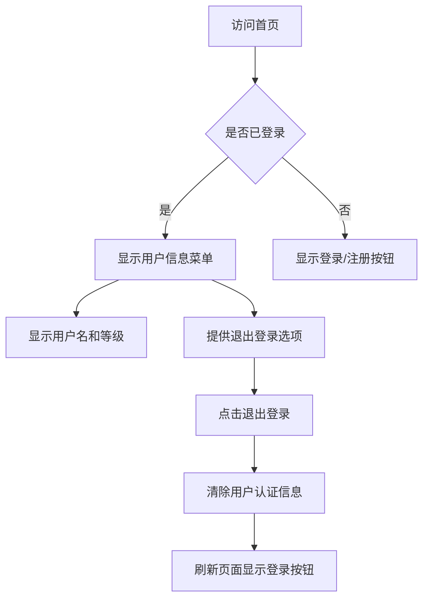

## 1. 产品概述

阿瓦隆是一款多人身份推理桌游，玩家分为正义阵营和邪恶阵营，通过任务投票和身份推理来决定胜负。游戏核心围绕玩家身份（Role）、任务执行（Quest）和游戏进程（Game）展开。本项目采用原型模式进行迭代开发，支持多人在线游戏，提供完整的游戏体验，包括房间创建、玩家匹配、游戏进行、结果统计等功能。

**游戏方式说明**：所有发言、演讲与讨论环节均在线下进行，系统仅负责状态同步、角色可见性、投票与任务结果计算，不提供线上文字或语音聊天功能。

## 2. 核心功能

### 2.1 用户角色

| 角色   | 注册方式      | 核心权限             |
| ---- | --------- | ---------------- |
| 游客用户 | 无需注册，快速加入 | 加入房间、参与基础游戏流程    |
| 注册用户 | 邮箱/手机号注册  | 创建房间、加入房间、进行基础游戏 |

一期工程说明：仅实现上述两类用户的核心功能，不包含好友系统、历史回放、管理员后台等复杂逻辑。

### 2.2 功能模块

阿瓦隆游戏系统一期（MVP）包含以下核心页面：

1. **首页**：游戏介绍、创建房间/加入房间入口、用户信息显示、退出登录。
2. **房间页面**：房间信息、玩家列表、开始游戏、用户信息显示、退出登录。
3. **游戏页面**：队伍提议、全员投票、任务执行、刺杀、游戏状态、用户信息显示、退出登录。
4. **角色揭示页**：私密身份展示，需长按解锁，倒计时自动隐藏、用户信息显示、退出登录。
5. **结果页面**：胜负结果、角色揭示、基础战绩统计、用户信息显示、退出登录。

一期范围说明：创建/加入仅在首页提供；不包含个人中心、语音/观战、排行榜、回放等复杂功能，聚焦核心流程的正确性与实时性。

### 2.3 页面详情

| 页面名称 | 模块名称 | 功能描述               |
| ---- | ---- | ------------------ |
| 首页   | 导航栏  | 显示用户状态、快速入口、菜单导航、当前登录用户信息、退出登录按钮 |
| 首页   | 用户菜单 | 显示用户名、用户等级、经验值、退出登录选项 |
| 首页   | 游戏介绍 | 展示游戏规则、玩法说明、新手教程   |
| 首页   | 房间列表 | 显示可加入的房间、房间状态、玩家数量 |
| 首页   | 快速开始 | 一键匹配、自动加入合适房间      |
| 首页   | 创建房间 | 注册用户创建房间、生成房间码     |
| 首页   | 加入房间 | 输入房间码加入房间（游客与注册用户） |
| 房间页面 | 房间信息 | 显示房间号、玩家人数、游戏设置    |
| 房间页面 | 玩家列表 | 显示所有玩家、准备状态、房主标识   |
| 房间页面 | 用户菜单 | 显示当前登录用户信息、退出登录选项 |
| 房间页面 | 角色分配 | 自动分配角色、显示角色信息、阵营信息 |
| 游戏页面 | 任务投票 | 显示当前任务、投票选项、投票结果   |
| 游戏页面 | 身份展示 | 显示玩家自己的角色、可见的其他角色  |
| 游戏页面 | 游戏状态 | 显示当前回合、任务进度、历史记录   |
| 游戏页面 | 用户菜单 | 显示当前登录用户信息、退出登录选项 |
| 角色揭示页 | 角色展示 | 私密身份展示、倒计时自动隐藏 |
| 角色揭示页 | 用户菜单 | 显示当前登录用户信息、退出登录选项 |
| 结果页面 | 结果展示 | 胜负结果、角色揭示、基础战绩统计 |
| 结果页面 | 用户菜单 | 显示当前登录用户信息、退出登录选项 |

## 3. 核心流程

### 3.1 用户认证流程

### 3.2 游戏主流程