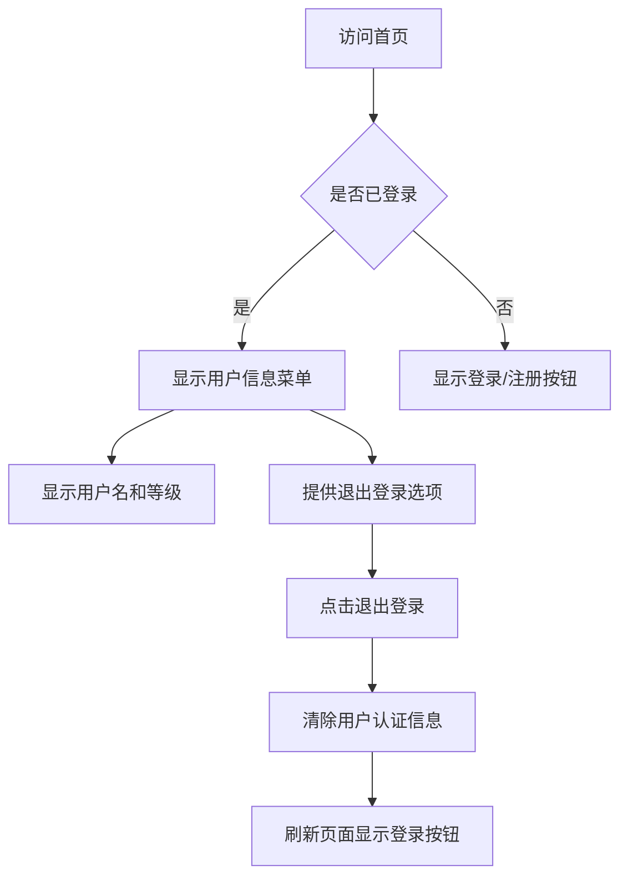

## 阿瓦隆，掌上桌游

阿瓦隆是一款多人身份推理桌游，玩家分为正义阵营和邪恶阵营，通过任务投票和身份推理来决定胜负。游戏核心围绕玩家身份（Role）、任务执行（Quest）和游戏进程（Game）展开。本项目采用原型模式进行迭代开发，支持多人在线游戏，提供完整的游戏体验，包括房间创建、玩家匹配、游戏进行、结果统计等功能。

**游戏方式说明**：所有发言、演讲与讨论环节均在线下进行，系统负责状态同步、角色可见性、投票与任务结果计算，不提供线上文字或语音聊天功能。

## TODO

- [ ] 用户注册、登陆功能
- [ ] 首页，信息展示，游戏开始按钮
- [ ] 房间页面，加入房间、快速创建

## 一. 核心功能

### 1.1 用户角色

| 角色     | 注册方式           | 核心权限                     |
| -------- | ------------------ | ---------------------------- |
| 游客用户 | 无需注册，快速加入 | 加入房间，参与游戏           |
| 注册用户 | 账号密码注册       | 创建房间、加入房间，参与游戏 |

### 1.2 功能模块

阿瓦隆游戏系统一期（MVP）包含以下核心页面：

1. **首页**：游戏介绍、开始游戏、用户登陆信息。
2. **房间页面**：加入房间、创建房间。
3. **游戏页面**：玩家列表、玩家标识、房间人数、游戏开始按钮、退出房间按钮。
4. **角色揭示页**：角色、看到的信息，需长按解锁，倒计时10秒。
5. **游戏进行页面**：挑选任务队员、投票、任务执行、刺杀、游戏状态等。
6. **结果页面**：胜负结果、角色揭示、基础战绩统计、用户信息显示。

### 1.3 页面详情

| 页面名称 | 模块名称     | 功能描述                                |
| -------- | ------------ | --------------------------------------- |
| 首页     | 导航栏       | 显示阿瓦隆图标，登陆/注册或登录用户信息 |
| 首页     | 开始游戏     | 开始游戏按钮，高亮显示                  |
| 首页     | 游戏介绍     | 展示游戏规则、说明，新手教程            |
| 房间页面 | 加入房间     | 输入 Code加入房间                       |
| 房间页面 | 创建房间     | 快速创建房间                            |
| 游戏页面 | 玩家列表     | 房主标识，玩家标识，房间人数            |
| 游戏页面 | 开始游戏按钮 |                                         |
| 游戏页面 | 退出房间按钮 |                                         |

## 二. 核心流程

### 2.1 用户认证流程

