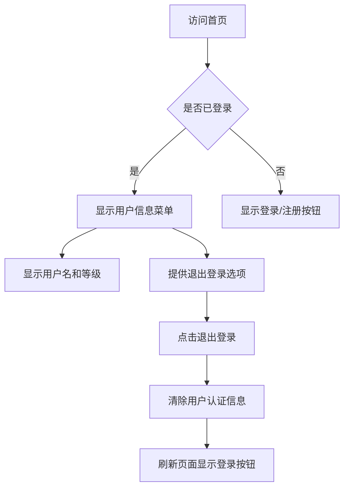

## 阿瓦隆，掌上桌游

阿瓦隆是一款多人身份推理桌游，玩家分为正义阵营和邪恶阵营，通过任务投票和身份推理来决定胜负。游戏核心围绕玩家身份（Role）、任务执行（Quest）和游戏进程（Game）展开。本项目采用原型模式进行迭代开发，支持多人在线游戏，提供完整的游戏体验，包括房间创建、玩家匹配、游戏进行、结果统计等功能。

**游戏方式说明**：所有发言、演讲与讨论环节均在线下进行，系统负责状态同步、角色可见性、投票与任务结果计算，不提供线上文字或语音聊天功能。

## TODO

- [ ] 用户注册、登陆功能
- [ ] 首页，信息展示，游戏开始按钮
- [ ] 房间页面，加入房间、快速创建

## 一. 核心功能

### 1.1 用户角色

| 角色     | 注册方式           | 核心权限                     |
| -------- | ------------------ | ---------------------------- |
| 游客用户 | 无需注册，快速加入 | 加入房间，参与游戏           |
| 注册用户 | 账号密码注册       | 创建房间、加入房间，参与游戏 |

### 1.2 功能模块

阿瓦隆游戏系统一期（MVP）包含以下核心页面：

1. **首页**：游戏介绍、开始游戏、用户登陆信息。
2. **房间页面**：加入房间、创建房间。
3. **游戏页面**：玩家列表、玩家标识、房间人数、游戏开始按钮、退出房间按钮。
4. **角色揭示页**：角色、看到的信息。
5. **游戏进行页面**：挑选任务队员、投票、任务执行、刺杀、游戏状态等。
6. **结果页面**：胜负结果、角色揭示、基础战绩统计、用户信息显示。

### 1.3 页面详情

| 页面名称 | 模块名称     | 功能描述     |
|------| ------------ |----------|
| 首页   | 导航栏       | 显示阿瓦隆图标，登陆/注册或登录用户信息 |
| 首页   | 开始游戏     | 开始游戏按钮，高亮显示 |
| 首页   | 游戏介绍     | 展示游戏规则、说明，新手教程 |
| 房间页面 | 加入房间     | 输入 Code加入房间 |
| 房间页面 | 创建房间     | 快速创建房间   |
| 游戏页面 | 玩家列表     | 房主标识，玩家标识，房间人数 |
| 游戏页面 | 开始游戏按钮 |          |
| 游戏页面 | 退出房间按钮 |          |
| 游戏页面 | 角色揭示页   | 角色及看到的信息 |

## 二. 核心流程

### 2.1 用户认证流程

## 三. 角色揭示页设计

### 3.1 设计理念

当房主点击开始游戏后，系统会为所有玩家随机分配角色。此时进入"角色查看阶段"（ROLE_VIEWING），所有玩家可以查看自己的角色信息和特殊能力。

### 3.2 角色揭示页内容结构

#### 基础信息

**角色名称**：玩家被分配的角色（如"梅林"、"刺客"等），并标识阵营。
 
#### 可见信息

根据角色类型，显示该角色能看到的其他玩家信息
  - 梅林：显示所有邪恶阵营玩家（除莫德雷德）
  - 派西维尔：显示梅林和莫甘娜（但不知道具体谁是谁）
  - 邪恶阵营：显示其他邪恶阵营成员
  - 忠臣：无特殊视野信息

#### 游戏提示区域
- **游戏目标**：根据阵营说明胜利条件
- **注意事项**：提醒玩家线下讨论时需要注意的事项
- **下一步操作**：提示玩家等待房主开始第一个任务

### 3.3 不同角色的可见性信息

#### 正义阵营角色
1. **梅林（Merlin）**
   - 可见信息：所有邪恶阵营玩家（除莫德雷德）
   - 能力描述：你知道邪恶阵营的所有成员，除了莫德雷德。小心隐藏自己的身份！

2. **派西维尔（Percival）**
   - 可见信息：梅林和莫甘娜（但不知道具体谁是谁）
   - 能力描述：你知道梅林和莫甘娜，但不知道谁是谁。需要仔细观察才能辨别真伪。

3. **亚瑟的忠臣（Loyal Servant）**
   - 可见信息：无特殊视野
   - 能力描述：你是忠诚的骑士，目标是完成神圣任务。相信你的队友！

#### 邪恶阵营角色
1. **刺客（Assassin）**
   - 可见信息：所有邪恶阵营成员（除奥伯伦）
   - 能力描述：你是邪恶阵营的领导者。游戏结束时，你可以尝试刺杀梅林。

2. **莫甘娜（Morgana）**
   - 可见信息：所有邪恶阵营成员（除奥伯伦）
   - 能力描述：你出现在派西维尔的视野中，看起来像梅林。误导正义阵营！

3. **莫德雷德（Mordred）**
   - 可见信息：其他邪恶阵营成员（除奥伯伦和自己）
   - 能力描述：梅林不知道你的身份。隐藏在暗影中破坏正义的计划。

4. **间谍（Minion）**
   - 可见信息：所有邪恶阵营成员（除奥伯伦）
   - 能力描述：你是邪恶阵营的普通成员。协助你的队友获得胜利。

5. **奥伯伦（Oberon）**
   - 可见信息：无邪恶阵营信息
   - 能力描述：其他邪恶成员不知道你的身份，你也不知道他们。独立行动！

### 3.4 技术实现要点

1. **数据安全**：确保每个玩家只能看到自己的角色信息和该角色应有的可见信息
2. **实时同步**：当所有玩家都查看完角色后，房主可以点击开始第一个任务
3. **状态管理**：游戏状态从ROLE_VIEWING转换为PLAYING
4. **WebSocket通知**：当房主开始第一个任务时，所有玩家实时收到状态更新

