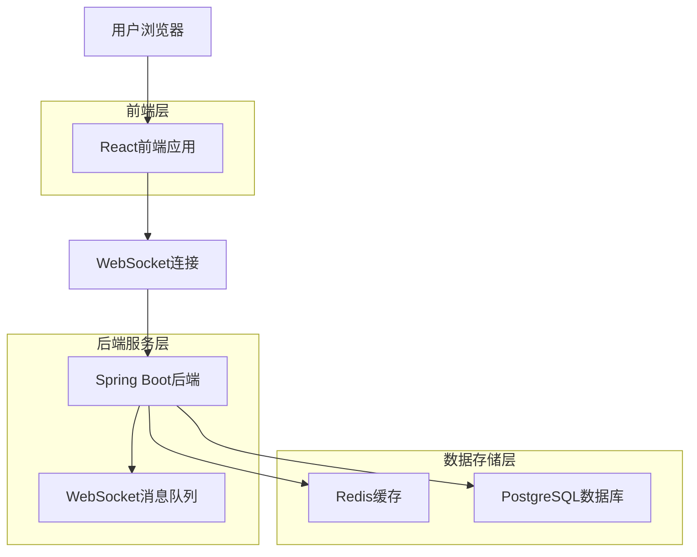
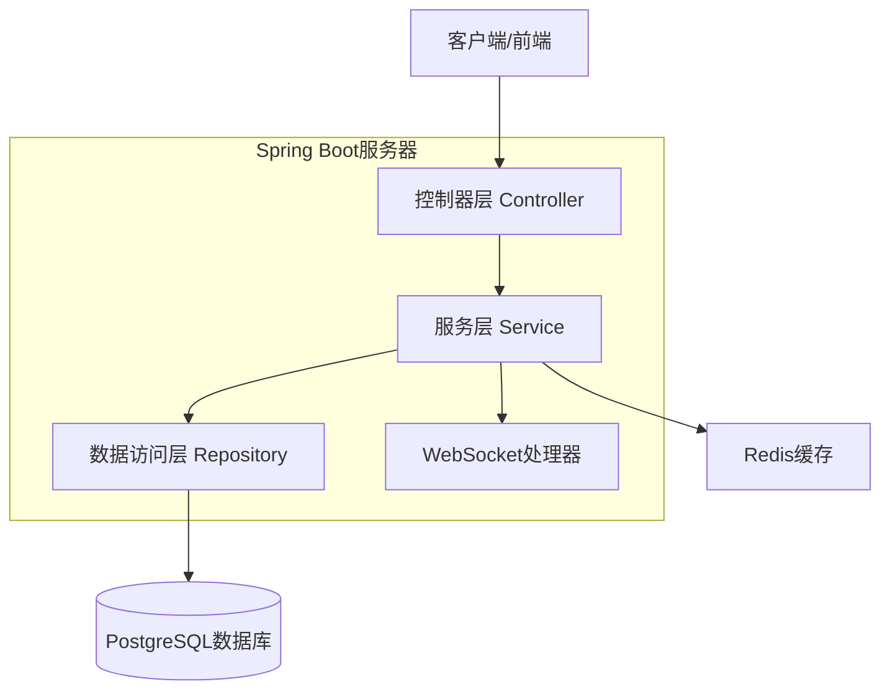
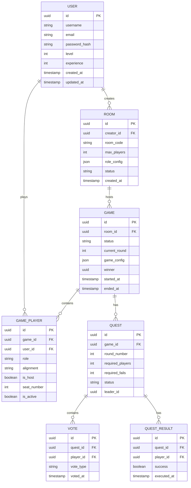
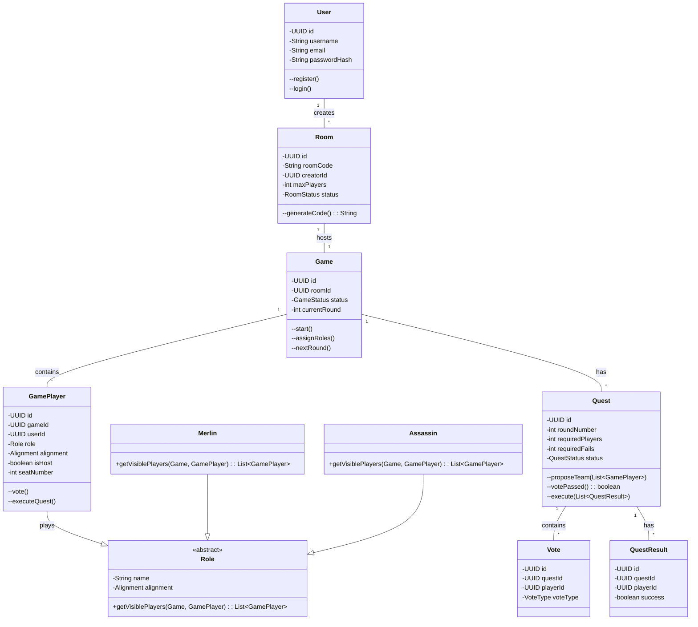
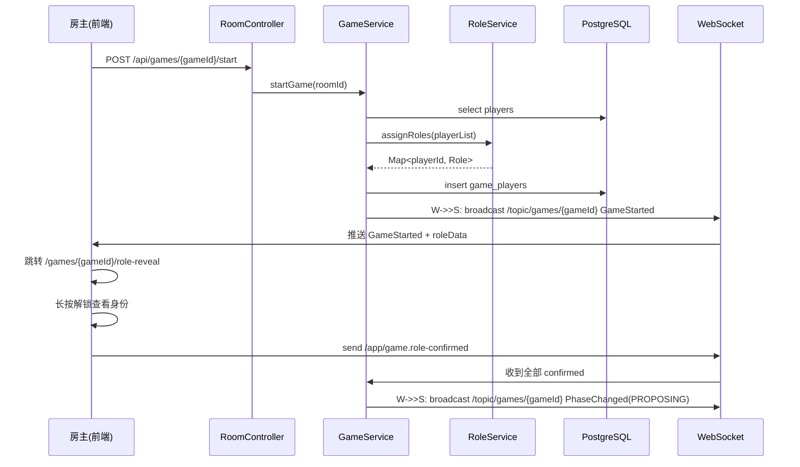
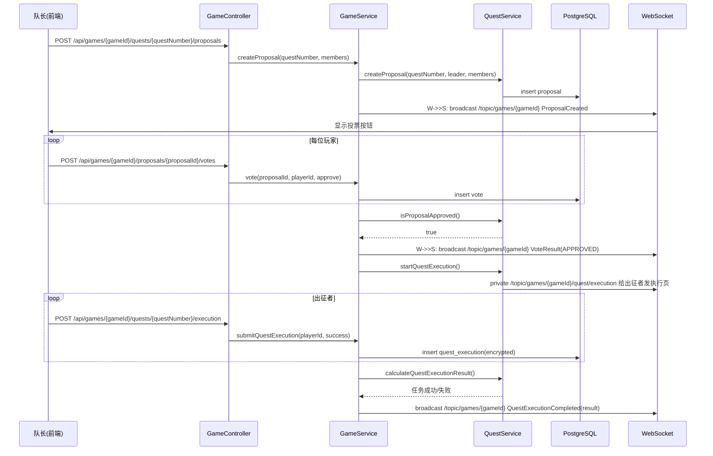
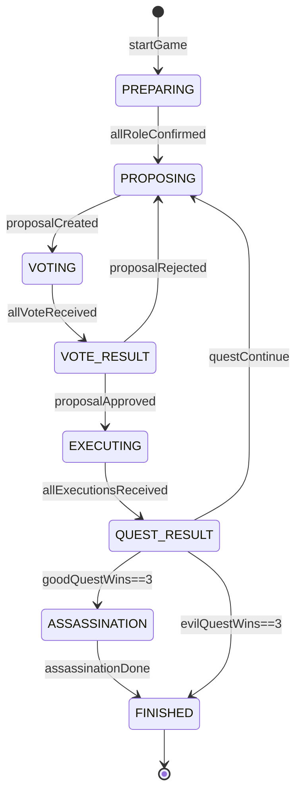

## 1. 架构设计



## 2. 技术描述

* **前端**: React\@18 + TypeScript + TailwindCSS + Vite

* **初始化工具**: vite-init

* **后端**: Spring Boot\@3 + Java 17 + Maven

* **数据库**: PostgreSQL\@15 + Redis\@7

* **实时通信**: WebSocket + STOMP协议

* **认证授权**: Spring Security + JWT

## 3. 路由定义

| 路由              | 用途           |
| --------------- | ------------ |
| /               | 首页，游戏介绍和入口   |
| /room           | 房间页面，创建和加入房间 |
| /game/:roomId   | 游戏页面，进行游戏    |
| /result/:gameId | 结果页面，显示游戏结果  |
| /profile        | 个人中心，用户信息和历史 |
| /login          | 登录页面         |
| /register       | 注册页面         |

## 4. API定义

### 4.1 用户认证API

**用户注册**

| 名称   | 请求方法 | 路径                   | 说明    |
| ---- | ---- | -------------------- | ----- |
| 用户注册 | POST | `/api/auth/register` | 新用户注册 |

请求体（Content-Type: application/json）：

```json
{
  "username": "merlin",
  "email": "merlin@avalon.com",
  "password": "sword123"
}
```

请求参数：

| 参数名      | 参数类型   | 是否必需 | 描述         |
| -------- | ------ | ---- | ---------- |
| username | string | 是    | 用户名，3-20字符 |
| email    | string | 是    | 邮箱地址       |
| password | string | 是    | 密码，6-20字符  |

响应体（201 Created）：

```json
{
  "userId": "a1b2c3d4-e5f6-7890-abcd-ef1234567890",
  "username": "merlin",
  "token": "eyJhbGciOiJIUzI1NiIsInR5cCI6IkpXVCJ9..."
}
```

**用户登录**

| 名称   | 请求方法 | 路径                | 说明   |
| ---- | ---- | ----------------- | ---- |
| 用户登录 | POST | `/api/auth/login` | 用户登录 |

请求体（Content-Type: application/json）：

```json
{
  "username": "merlin",
  "password": "sword123"
}
```

请求参数：

| 参数名      | 参数类型   | 是否必需 | 描述     |
| -------- | ------ | ---- | ------ |
| username | string | 是    | 用户名或邮箱 |
| password | string | 是    | 密码     |

响应体（200 OK）：

```json
{
  "userId": "a1b2c3d4-e5f6-7890-abcd-ef1234567890",
  "username": "merlin",
  "token": "eyJhbGciOiJIUzI1NiIsInR5cCI6IkpXVCJ9..."
}
```

### 4.2 房间管理API

**创建房间**

| 名称   | 请求方法 | 路径           | 说明     |
| ---- | ---- | ------------ | ------ |
| 创建房间 | POST | `/api/rooms` | 房主创建房间 |

请求体（Content-Type: application/json）：

```json
{
  "maxPlayers": 7,
  "roleConfig": {
    "merlin": true,
    "percival": true,
    "morgana": true,
    "assassin": true
  }
}
```

请求参数：

| 参数名        | 参数类型    | 是否必需 | 描述         |
| ---------- | ------- | ---- | ---------- |
| maxPlayers | integer | 是    | 最大玩家数，5-10 |
| roleConfig | object  | 否    | 角色配置对象     |

响应体（201 Created）：

```json
{
  "roomId": "c5d6e7f8-1234-5678-9abc-def123456789",
  "roomCode": "A3B9C1",
  "hostId": "a1b2c3d4-e5f6-7890-abcd-ef1234567890",
  "maxPlayers": 7,
  "roleConfig": { "merlin": true, "percival": true, "morgana": true, "assassin": true },
  "createdAt": "2025-11-17T12:34:56Z"
}
```

**加入房间**

| 名称   | 请求方法 | 路径                         | 说明     |
| ---- | ---- | -------------------------- | ------ |
| 加入房间 | POST | `/api/rooms/{roomId}/join` | 玩家加入房间 |

请求参数：无（路径参数 `roomId`）

响应体（200 OK）：

```json
{
  "roomId": "c5d6e7f8-1234-5678-9abc-def123456789",
  "playerId": "f9e8d7c6-5432-1098-7654-321098765432",
  "seatIdx": 3
}
```

**获取房间信息**

| 名称   | 请求方法 | 路径                    | 说明     |
| ---- | ---- | --------------------- | ------ |
| 房间信息 | GET  | `/api/rooms/{roomId}` | 获取房间详情 |

请求参数：无（路径参数 `roomId`）

响应体（200 OK）：

```json
{
  "roomId": "c5d6e7f8-1234-5678-9abc-def123456789",
  "roomCode": "A3B9C1",
  "hostId": "a1b2c3d4-e5f6-7890-abcd-ef1234567890",
  "hostName": "merlin",
  "maxPlayers": 7,
  "players": [
    { "playerId": "xxx", "nickname": "merlin", "seatIdx": 0, "isReady": true },
    { "playerId": "yyy", "nickname": "morgana", "seatIdx": 1, "isReady": false }
  ],
  "status": "WAITING",
  "createdAt": "2025-11-17T12:34:56Z"
}
```

### 4.3 游戏资源API（RESTful）

| 名称       | 请求方法 | 路径                                                   | 说明           |
| -------- | ---- | ---------------------------------------------------- | ------------ |
| 房主开始游戏   | POST | `/api/games/{gameId}/start`                          | 房主开始一局游戏     |
| 队长提议出征成员 | POST | `/api/games/{gameId}/quests/{questNumber}/proposals` | 当前队长提交本轮出征名单 |
| 玩家投票     | POST | `/api/games/{gameId}/proposals/{proposalId}/votes`   | 全体玩家对提案投票    |
| 查看投票情况   | GET  | `/api/games/{gameId}/proposals/{proposalId}/votes`   | 查询当前提案投票汇总   |
| 出征者提交任务  | POST | `/api/games/{gameId}/quests/{questNumber}/execution` | 出征成员匿名提交任务结果 |
| 查看任务结果   | GET  | `/api/games/{gameId}/quests/{questNumber}/result`    | 获取本轮任务最终成败   |
| 刺客查看可选目标 | GET  | `/api/games/{gameId}/assassination/targets`          | 刺客查看可刺杀玩家列表  |
| 刺客执行刺杀   | POST | `/api/games/{gameId}/assassination`                  | 刺客选择目标完成刺杀   |

请求/响应概览：

| 名称       | 最小角色 | 请求体                                    | 响应体                      |
| -------- | ---- | -------------------------------------- | ------------------------ |
| 房主开始游戏   | 房主   | `{}`                                   | `GameStartedDTO`         |
| 队长提议出征成员 | 当前队长 | `ProposedTeamDTO {members: UUID[]}`    | `TeamProposedDTO`        |
| 玩家投票     | 全体玩家 | `VoteDTO {approve: boolean}`           | `VoteReceivedDTO`        |
| 查看投票情况   | 全体玩家 | —                                      | `VoteSummaryDTO`         |
| 出征者提交任务  | 出征成员 | `QuestExecutionDTO {success: boolean}` | `QuestExecutedDTO`       |
| 查看任务结果   | 全体玩家 | —                                      | `QuestResultDTO`         |
| 刺客查看可选目标 | 刺客   | —                                      | `List<PlayerDTO>`        |
| 刺客执行刺杀   | 刺客   | `AssassinationDTO {targetId: UUID}`    | `AssassinationResultDTO` |

权限校验规则（Spring Security 伪代码）：

```java
@PreAuthorize("isHost(#gameId)")          // 仅房主
@PreAuthorize("isCurrentLeader(#gameId)") // 仅当前队长
@PreAuthorize("isQuestMember(#gameId)")   // 仅本轮出征者
@PreAuthorize("hasRole(#gameId, 'ASSASSIN')") // 仅刺客
@PreAuthorize("isPlayer(#gameId)")      // 任意局内玩家
```

## 5. 服务器架构



## 6. 数据模型

### 6.1 数据模型定义



### 6.2 数据定义语言

**用户表 (users)**

```sql
CREATE TABLE users (
    id UUID PRIMARY KEY DEFAULT gen_random_uuid(),
    username VARCHAR(50) UNIQUE NOT NULL,
    email VARCHAR(255) UNIQUE NOT NULL,
    password_hash VARCHAR(255) NOT NULL,
    level INTEGER DEFAULT 1,
    experience INTEGER DEFAULT 0,
    avatar_url VARCHAR(500),
    created_at TIMESTAMP WITH TIME ZONE DEFAULT NOW(),
    updated_at TIMESTAMP WITH TIME ZONE DEFAULT NOW()
);

CREATE INDEX idx_users_username ON users(username);
CREATE INDEX idx_users_email ON users(email);
```

**房间表 (rooms)**

```sql
CREATE TABLE rooms (
    id UUID PRIMARY KEY DEFAULT gen_random_uuid(),
    creator_id UUID REFERENCES users(id),
    room_code VARCHAR(10) UNIQUE NOT NULL,
    max_players INTEGER NOT NULL CHECK (max_players >= 5 AND max_players <= 10),
    role_config JSONB DEFAULT '{}',
    status VARCHAR(20) DEFAULT 'waiting' CHECK (status IN ('waiting', 'playing', 'ended')),
    created_at TIMESTAMP WITH TIME ZONE DEFAULT NOW()
);

CREATE INDEX idx_rooms_code ON rooms(room_code);
CREATE INDEX idx_rooms_status ON rooms(status);
```

**游戏表 (games)**

```sql
CREATE TABLE games (
    id UUID PRIMARY KEY DEFAULT gen_random_uuid(),
    room_id UUID REFERENCES rooms(id),
    status VARCHAR(20) DEFAULT 'preparing' CHECK (status IN ('preparing', 'playing', 'ended')),
    current_round INTEGER DEFAULT 1,
    game_config JSONB DEFAULT '{}',
    winner VARCHAR(10),
    started_at TIMESTAMP WITH TIME ZONE,
    ended_at TIMESTAMP WITH TIME ZONE,
    created_at TIMESTAMP WITH TIME ZONE DEFAULT NOW()
);

CREATE INDEX idx_games_room ON games(room_id);
CREATE INDEX idx_games_status ON games(status);
```

**游戏玩家表 (game\_players)**

```sql
CREATE TABLE game_players (
    id UUID PRIMARY KEY DEFAULT gen_random_uuid(),
    game_id UUID REFERENCES games(id),
    user_id UUID REFERENCES users(id),
    role VARCHAR(30) NOT NULL,
    alignment VARCHAR(10) NOT NULL CHECK (alignment IN ('good', 'evil')),
    is_host BOOLEAN DEFAULT FALSE,
    seat_number INTEGER NOT NULL,
    is_active BOOLEAN DEFAULT TRUE,
    created_at TIMESTAMP WITH TIME ZONE DEFAULT NOW()
);

CREATE INDEX idx_game_players_game ON game_players(game_id);
CREATE INDEX idx_game_players_user ON game_players(user_id);
```

**任务表 (quests)**

```sql
CREATE TABLE quests (
    id UUID PRIMARY KEY DEFAULT gen_random_uuid(),
    game_id UUID REFERENCES games(id),
    round_number INTEGER NOT NULL,
    required_players INTEGER NOT NULL,
    required_fails INTEGER DEFAULT 1,
    status VARCHAR(20) DEFAULT 'proposing' CHECK (status IN ('proposing', 'voting', 'executing', 'completed', 'failed')),
    leader_id UUID REFERENCES users(id),
    created_at TIMESTAMP WITH TIME ZONE DEFAULT NOW()
);

CREATE INDEX idx_quests_game ON quests(game_id);
```

**投票表 (votes)**

```sql
CREATE TABLE votes (
    id UUID PRIMARY KEY DEFAULT gen_random_uuid(),
    quest_id UUID REFERENCES quests(id),
    player_id UUID REFERENCES users(id),
    vote_type VARCHAR(10) NOT NULL CHECK (vote_type IN ('approve', 'reject')),
    voted_at TIMESTAMP WITH TIME ZONE DEFAULT NOW()
);

CREATE INDEX idx_votes_quest ON votes(quest_id);
CREATE INDEX idx_votes_player ON votes(player_id);
```

## 7. 面向对象分析

### 7.1 核心类设计

**Game类（游戏核心）**

职能：一局游戏的“状态机 + 规则引擎”。

* 保存整局元数据（id、房间、当前轮次、状态机阶段）

* 负责阶段推进、角色分配、胜负判定、并发写保护（事务）

```java
public class Game {
    private UUID id;               // 局唯一标识
    private Room room;             // 所属房间
    private GameStatus status;     // 当前阶段（PREPARING / PROPOSING / VOTING ...）
    private int currentQuest;      // 第几轮任务（1-5）
    private List<GamePlayer> players; // 座位列表（含角色）
    private List<Quest> quests;    // 每轮任务快照，用于复盘
    private GameConfig config;   // 角色配置、最大人数等

    /**
     * 房主调用：把房间状态改为 PREPARING，分配角色，推送 WebSocket 事件
     */
    public void startGame();

    /**
     * 根据 config 把角色随机发到玩家，同时写入可见性缓存（Role#getVisiblePlayers）
     */
    public void assignRoles();

    /**
     * 收集完所有玩家投票后触发：
     * - 计算通过/否决
     * - 若通过→EXECUTING，给出征者推送执行页
     * - 若否决→PROPOSING，轮次+1，换队长
     * - 连续否决5次直接判邪恶胜利
     */
    public void processProposalVote(Proposal proposal);

    /**
     * 出征者全部提交任务卡后调用：
     * - 按规则计算成败（需至少1张失败即失败，第4轮需2张失败才失败）
     * - 更新好人/坏人任务胜利计数
     * - 进入 QUEST_RESULT 并广播结果
     */
    public void calculateQuestResult(Quest quest);

    /**
     * 好人3任务胜→进入 ASSASSINATION；
     * 坏人3任务胜→直接 FINISHED 邪恶胜利；
     * 刺杀完成→根据是否命中 Merlin 决定最终阵营胜利
     */
    public GameResult calculateFinalResult(Assassination assassination);
}
```

**Player类（玩家）**

职能：房间座位上的“玩家”身份，聚合用户、角色、阵营、准备状态。

* 负责投票、任务执行、可见性查询（自己能看到谁）

```java
public class Player {
    private UUID id;               // 座位唯一标识
    private String nickname;       // 房内昵称（可与用户名不同）
    private User user;             // 关联注册用户（游客时为空）
    private Role role;             // 分配到的角色（Merlin/Assassin...）
    private Alignment alignment;   // 阵营缓存（GOOD/EVIL）
    private boolean isHost;        // 是否为房主
    private int seatNumber;        // 座位序号（0 开始）
    private boolean isReady;       // 准备状态（开始游戏前）
    private boolean isActive;      // 是否仍在局内（掉线/逃跑标记）

    /**
     * 对当前提案投票；写入 Vote 记录并触发 Game.processProposalVote
     */
    public Vote voteProposal(Proposal proposal, boolean approve);

    /**
     * 出征者匿名提交任务卡；仅当本玩家本轮在出征列表才可调用
     * @return true=任务成功，false=任务失败（由角色决定能否投失败）
     */
    public boolean submitQuestCard(boolean success);

    /**
     * 返回“我”能看到哪些其他玩家（由 Role 策略决定，例如 Merlin 可见 Morgana）
     */
    public List<Player> getVisiblePlayers(Game game);

    /**
     * 刺客阶段选择刺杀目标；写入 Assassination 记录
     */
    public Assassination chooseAssassinationTarget(Player target);
}
```

**Role类（角色系统）**

职能：把“谁能看见谁”、“能否投失败卡”等**角色差异规则**封装成策略，方便扩展新角色。

* 每个具体角色（Merlin、Assassin...）继承并实现抽象方法

```java
public abstract class Role {
    protected String name;               // 角色英文名（MERLIN、ASSASSIN...）
    protected Alignment alignment;     // 所属阵营（GOOD/EVIL）
    protected String description;      // 前端展示用中文描述
    protected boolean canFailQuest;    // 能否在任务中主动投“失败”卡（仅邪恶角色 true）

    /**
     * 核心可见性策略：返回“当前玩家”能看到的其他玩家列表。
     * 例如 Merlin 实现里会额外把 EVIL 阵营（除 Mordred）加入返回列表。
     */
    public abstract List<Player> getVisiblePlayers(Game game, Player currentPlayer);

    /**
     * 是否拥有主动技能（目前仅刺客在刺杀阶段触发）。
     * 若有，前端在对应阶段展示技能按钮；后端在技能触发时调用 onAbilityUse
     */
    public boolean hasActiveAbility() { return false; }

    /**
     * 主动技能触发回调；子类可在这里写刺杀、湖女等逻辑
     */
    public void onAbilityUse(Game game, Player self, Player target) {
        // 默认无操作
    }
}
```

**Quest类（任务系统）**

职能：封装“一轮任务”的完整生命周期数据与规则。

* 保存队长、提案成员、投票记录、任务执行结果

* 提供“投票是否通过”“任务成败判定”等无状态计算

```java
public class Quest {
    private UUID id;                       // 任务唯一标识
    private int questNumber;               // 第几轮任务（1-5）
    private int requiredPlayers;           // 本轮需要出征人数（依人数表）
    private int requiredFails;             // 本轮需几张“失败”才判任务失败（第4轮=2，其余=1）
    private QuestStatus status;          // 阶段：PROPOSED / VOTING / REJECTED / EXECUTED
    private Player leader;               // 本轮队长（提议者）
    private List<Player> proposedMembers; // 队长提交的出征名单（不可再改）
    private List<Vote> votes;              // 全体玩家投票记录（含赞成/反对）
    private List<QuestExecution> executions; // 出征者匿名投的任务卡（success/fail）
    private QuestResult result;            // 最终成败（SUCCESS / FAIL / null）

    /**
     * 投票阶段结束调用：统计赞成/反对，达到半数以上赞成即通过
     * @return true 通过，false 否决
     */
    public boolean isProposalApproved();

    /**
     * 所有出征者提交任务卡后调用：
     * - 按 requiredFails 规则计算成败
     * - 写回 result 并改状态为 EXECUTED
     */
    public void calculateQuestResult();

    /**
     * 快速查询本轮任务最终成败；若未执行完返回 Optional.empty()
     */
    public Optional<QuestResult> getResult();

    /**
     * 复盘用：返回失败卡张数（用于前端展示“几张失败”）
     */
     public int getFailCardCount();
}
```

### 7.2 设计模式应用

**原型模式（Prototype Pattern）**
用于角色创建和游戏配置，支持快速复制和定制化：

* `RolePrototype`: 角色原型管理

* `GameConfigPrototype`: 游戏配置原型

**观察者模式（Observer Pattern）**
用于游戏状态变更通知：

* `GameObserver`: 游戏状态观察者

* `WebSocketPublisher`: 实时消息推送

**策略模式（Strategy Pattern）**
用于不同的胜利条件判断：

* `VictoryConditionStrategy`: 胜利条件策略

* `QuestVictoryStrategy`: 任务胜利策略

* `AssassinationVictoryStrategy`: 刺杀胜利策略

***

## 8. 面向对象建模

### 8.1 用例模型（Use-Case Model）

```mermaid
graph LR
    actor P as 玩家
    actor S as 系统
    rectangle "Avalon" {
        UC1((UC1 注册/登录))
        UC2((UC2 创建房间))
        UC3((UC3 加入房间))
        UC4((UC4 分配角色))
        UC5((UC5 查看身份（私密）))
        UC6((UC6 提议队伍))
        UC7((UC7 投票))
        UC8((UC8 计算投票))
        UC9((UC9 执行任务))
        UC10((UC10 公布任务结果))
        UC11((UC11 刺杀（刺客）))
        UC12((UC12 公布最终胜负))
    }
    P --> UC1
    P --> UC2
    P --> UC3
    S --> UC4
    P --> UC5
    P --> UC6
    P --> UC7
    S --> UC8
    P --> UC9
    S --> UC10
    P --> UC11
    S --> UC12
```

| 用例编号 | 用例名称  | 参与者 | 前置条件         | 典型流程（主干）                                         |
| ---- | ----- | --- | ------------ | ------------------------------------------------ |
| UC1  | 注册/登录 | 玩家  | 无            | 1. 输入用户名+密码2. 系统校验并返回JWT3. 进入首页                  |
| UC2  | 创建房间  | 玩家  | 已登录          | 1. 点击“创建房间”2. 设置人数（5-10）3. 系统生成roomCode并返回房间页    |
| UC3  | 加入房间  | 玩家  | 拥有有效roomCode | 1. 输入roomCode2. 系统校验房间状态waiting3. 进入房间页          |
| UC4  | 分配角色  | 系统  | 房主点击“开始游戏”   | 1. 系统按人数与配置随机分配角色2. 生成Game与GamePlayer记录3. 推送角色数据 |
| UC5  | 查看身份  | 玩家  | 角色已分配        | 1. 进入/role-reveal页2. 长按解锁查看身份与可见列表3. 倒计时结束自动遮罩   |
| UC6  | 提议队伍  | 队长  | 轮到该玩家当队长     | 1. 拖拽玩家头像到出征区2. 点击“确认提议”3. 系统进入投票阶段              |
| UC7  | 投票    | 玩家  | 处于投票阶段       | 1. 点击“赞成/反对”2. 系统实时更新投票计数                        |
| UC8  | 计算投票  | 系统  | 所有玩家完成投票     | 1. 若赞成>反对：任务进入执行阶段2. 否则轮次+1，换队长重新提议              |
| UC9  | 执行任务  | 出征者 | 投票通过且轮到出征    | 1. 出征者选择“成功/失败”暗扣2. 提交后系统加密存储结果                  |
| UC10 | 公布结果  | 系统  | 所有出征者已提交     | 1. 按规则计算是否失败2. 更新任务格颜色3. 推送下一阶段                  |
| UC11 | 刺杀    | 刺客  | 好人取得3次任务胜利   | 1. 刺客选择刺杀目标2. 系统验证是否为梅林3. 决定最终胜负                 |
| UC12 | 公布胜负  | 系统  | 刺杀完成或任务失败3次  | 1. 显示胜负海报2. 横向时间轴揭示全部身份3. 生成战绩卡片                 |

### 8.2 类模型（Class Model）



### 8.3 时序图（Sequence Diagram）

**场景 1：房主开始游戏 → 角色揭示**



**场景 2：队长提议队伍 → 投票 → 任务执行**



### 8.4 游戏阶段定义与流转

| 阶段代码          | 阶段名称 | 触发条件        | 前端页面         | 后端行为         |
| ------------- | ---- | ----------- | ------------ | ------------ |
| PREPARING     | 角色揭示 | 房主点击开始      | /role-reveal | 分配角色，推送角色数据  |
| PROPOSING     | 队长提议 | 上轮投票失败或新回合  | /game        | 标记当前队长，等待提议  |
| VOTING        | 全员投票 | 队长已提交名单     | /game        | 收集赞成/反对，实时计数 |
| VOTE\_RESULT  | 投票结果 | 所有人已投票      | /game        | 计算通过/失败，推送结果 |
| EXECUTING     | 任务执行 | 投票通过        | /game        | 仅给出征者推送执行页   |
| QUEST\_RESULT | 任务结果 | 出征者全部提交     | /game        | 解密计算成败，更新进度条 |
| ASSASSINATION | 刺杀   | 好人3次任务胜     | /game        | 仅刺客可见刺杀按钮    |
| FINISHED      | 终局结算 | 刺杀完成或坏人3任务胜 | /result      | 揭示身份，生成战绩卡片  |

> 阶段推进由后端 `GameStateMachine` 统一驱动，前端仅订阅 `PhaseChangedEvent` 并路由到对应子页面。

阶段流转图：



### 8.5 设计约束与约定

1. **可见性规则**由 `Role.getVisiblePlayers()` 统一封装，禁止在 UI 层硬编码角色列表。
2. **所有写操作**（投票、任务结果、刺杀）必须走数据库事务，防止并发重复提交。
3. **WebSocket 消息**按 `games/{gameId}` 分区，前端订阅 `/topic/games/{gameId}` 公共频道与 `/user/{userId}/games/{gameId}` 私有频道。
4. **roomCode** 仅用于外部输入/分享，内部一律使用 `roomId` 与 `gameId` 主键，避免主键遍历攻击。
5. **角色揭示页**数据一次性推送后前端本地保存，不再向后端请求，减少泄露面。

