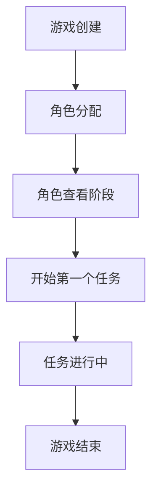

# 开始第一个Quest功能设计方案

## 1. 概述

本文档描述了阿瓦隆游戏中开始第一个Quest的功能设计。该功能允许在所有玩家查看完角色信息后，正式启动游戏的第一个任务。

## 2. 设计原则

### 2.1 状态转换原则
- 游戏必须处于`ROLE_VIEWING`状态才能开始第一个任务
- 开始第一个任务后，游戏状态将转换为`PLAYING`状态
- 一次性创建所有任务，但只启动第一个任务

### 2.2 统一接口原则
- 使用统一的[startQuest](file:///Users/xlxing/IdeaProjects/avalon/src/main/java/cn/xiaolin/avalon/service/GameService.java#L428-L451)方法处理所有任务的开始，包括第一个任务
- 不为第一个任务创建特殊的处理逻辑

## 3. 功能流程

### 3.1 前置条件
1. 游戏已创建并处于`ROLE_VIEWING`状态
2. 所有玩家已完成角色查看
3. 房间中有5-10名玩家

### 3.2 处理流程
1. 验证游戏状态是否为`ROLE_VIEWING`
2. 获取玩家数量并创建所有任务
3. 设置第一个任务的队长
4. 更新游戏状态为`PLAYING`
5. 发送WebSocket通知所有玩家第一个任务已开始

### 3.3 状态转换图


## 4. 接口设计

### 4.1 REST API
- **Endpoint**: `POST /api/games/{gameId}/quest?isFirstQuest=true`
- **Method**: POST
- **权限**: 仅房主可调用
- **请求参数**: 
  - Path Parameter: `gameId` (UUID)
- **响应格式**:
  ```json
  {
    "success": true,
    "message": "第一个任务开始成功",
    "data": ""
  }
  ```

### 4.2 WebSocket通知
- **Topic**: `/topic/game/{gameId}`
- **消息类型**: `QUEST_STARTED`
- **内容**: "任务已开始"

## 5. 数据模型变更

### 5.1 Quest实体
- 新增任务实体用于表示每一轮任务
- 包含轮次号、所需玩家数、所需失败数等属性

### 5.2 Game实体
- 游戏状态从`ROLE_VIEWING`更新为`PLAYING`

## 6. 异常处理

### 6.1 主要异常场景
1. 游戏不存在
2. 游戏状态不正确
3. 数据库操作失败

### 6.2 错误响应格式
```json
{
  "success": false,
  "message": "错误信息"
}
```

## 7. 测试用例

### 7.1 成功场景
- 验证在正确状态下能够成功开始第一个任务
- 验证WebSocket消息正确发送
- 验证游戏状态正确更新

### 7.2 异常场景
- 验证在错误状态下无法开始第一个任务
- 验证非房主无法调用接口
- 验证游戏不存在时的错误处理

## 8. 性能考虑
- 使用事务确保数据一致性
- 避免N+1查询问题
- 合理使用数据库索引