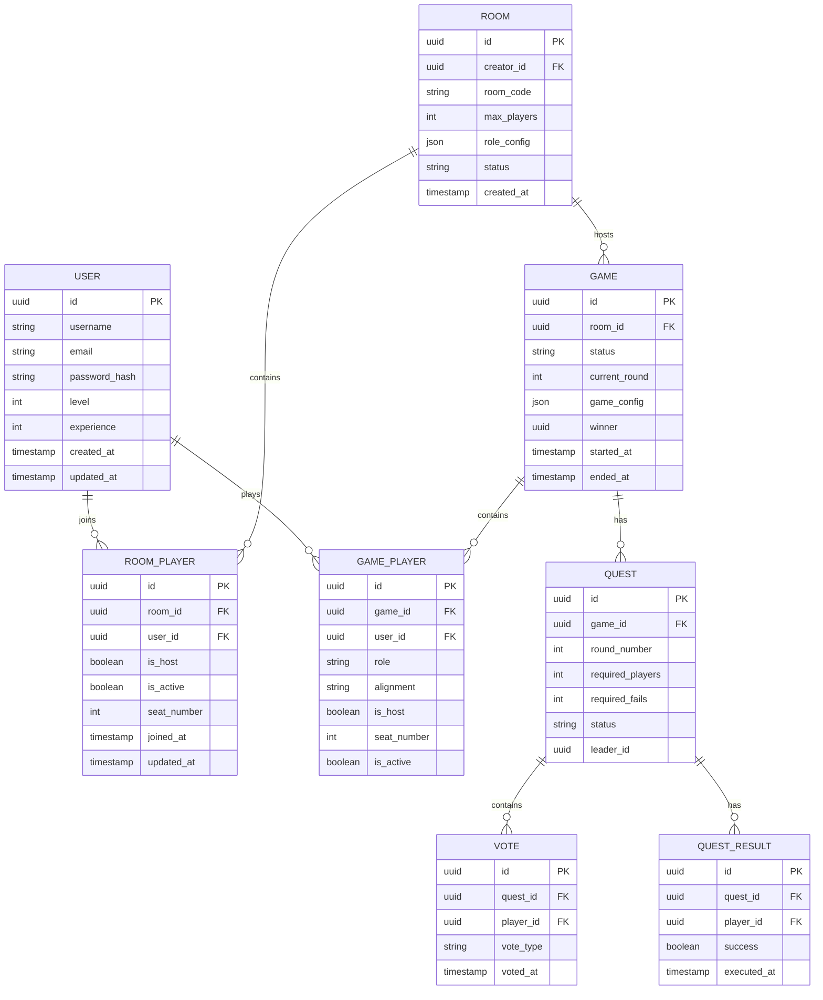

# 数据模型设计

## 1. 数据模型定义



## 2. 数据定义语言

**用户表 (users)**

```sql
CREATE TABLE users (
    id UUID PRIMARY KEY DEFAULT gen_random_uuid(),
    username VARCHAR(50) UNIQUE NOT NULL,
    email VARCHAR(255) UNIQUE NOT NULL,
    password_hash VARCHAR(255) NOT NULL,
    level INTEGER DEFAULT 1,
    experience INTEGER DEFAULT 0,
    avatar_url VARCHAR(500),
    created_at TIMESTAMP WITH TIME ZONE DEFAULT NOW(),
    updated_at TIMESTAMP WITH TIME ZONE DEFAULT NOW()
);

CREATE INDEX idx_users_username ON users(username);
CREATE INDEX idx_users_email ON users(email);
```

**房间表 (rooms)**

```sql
CREATE TABLE rooms (
    id UUID PRIMARY KEY DEFAULT gen_random_uuid(),
    creator_id UUID REFERENCES users(id),
    room_code VARCHAR(10) UNIQUE NOT NULL,
    max_players INTEGER NOT NULL CHECK (max_players >= 5 AND max_players <= 10),
    role_config JSONB DEFAULT '{}',
    status VARCHAR(20) DEFAULT 'waiting' CHECK (status IN ('waiting', 'playing', 'ended')),
    created_at TIMESTAMP WITH TIME ZONE DEFAULT NOW()
);

CREATE INDEX idx_rooms_code ON rooms(room_code);
CREATE INDEX idx_rooms_status ON rooms(status);
```

**房间玩家表 (room_players)**

```sql
CREATE TABLE room_players (
    id UUID PRIMARY KEY DEFAULT gen_random_uuid(),
    room_id UUID REFERENCES rooms(id),
    user_id UUID REFERENCES users(id),
    is_host BOOLEAN DEFAULT FALSE,
    is_active BOOLEAN DEFAULT TRUE,
    seat_number INTEGER,
    joined_at TIMESTAMP WITH TIME ZONE DEFAULT NOW(),
    updated_at TIMESTAMP WITH TIME ZONE DEFAULT NOW()
);

CREATE INDEX idx_room_players_room ON room_players(room_id);
CREATE INDEX idx_room_players_user ON room_players(user_id);
CREATE INDEX idx_room_players_active ON room_players(is_active);
```

**游戏表 (games)**

```sql
CREATE TABLE games (
    id UUID PRIMARY KEY DEFAULT gen_random_uuid(),
    room_id UUID REFERENCES rooms(id),
    status VARCHAR(20) DEFAULT 'preparing' CHECK (status IN ('preparing', 'playing', 'ended')),
    current_round INTEGER DEFAULT 1,
    game_config JSONB DEFAULT '{}',
    winner VARCHAR(10),
    started_at TIMESTAMP WITH TIME ZONE,
    ended_at TIMESTAMP WITH TIME ZONE,
    created_at TIMESTAMP WITH TIME ZONE DEFAULT NOW()
);

CREATE INDEX idx_games_room ON games(room_id);
CREATE INDEX idx_games_status ON games(status);
```

**游戏玩家表 (game_players)**

```sql
CREATE TABLE game_players (
    id UUID PRIMARY KEY DEFAULT gen_random_uuid(),
    game_id UUID REFERENCES games(id),
    user_id UUID REFERENCES users(id),
    role VARCHAR(30) NOT NULL,
    alignment VARCHAR(10) NOT NULL CHECK (alignment IN ('good', 'evil')),
    is_host BOOLEAN DEFAULT FALSE,
    seat_number INTEGER NOT NULL,
    is_active BOOLEAN DEFAULT TRUE,
    created_at TIMESTAMP WITH TIME ZONE DEFAULT NOW()
);

CREATE INDEX idx_game_players_game ON game_players(game_id);
CREATE INDEX idx_game_players_user ON game_players(user_id);
```

**任务表 (quests)**

```sql
CREATE TABLE quests (
    id UUID PRIMARY KEY DEFAULT gen_random_uuid(),
    game_id UUID REFERENCES games(id),
    round_number INTEGER NOT NULL,
    required_players INTEGER NOT NULL,
    required_fails INTEGER DEFAULT 1,
    status VARCHAR(20) DEFAULT 'proposing' CHECK (status IN ('proposing', 'voting', 'executing', 'completed', 'failed')),
    leader_id UUID REFERENCES users(id),
    created_at TIMESTAMP WITH TIME ZONE DEFAULT NOW()
);

CREATE INDEX idx_quests_game ON quests(game_id);
```

**投票表 (votes)**

```sql
CREATE TABLE votes (
    id UUID PRIMARY KEY DEFAULT gen_random_uuid(),
    quest_id UUID REFERENCES quests(id),
    player_id UUID REFERENCES users(id),
    vote_type VARCHAR(10) NOT NULL CHECK (vote_type IN ('approve', 'reject')),
    voted_at TIMESTAMP WITH TIME ZONE DEFAULT NOW()
);

CREATE INDEX idx_votes_quest ON votes(quest_id);
CREATE INDEX idx_votes_player ON votes(player_id);
```