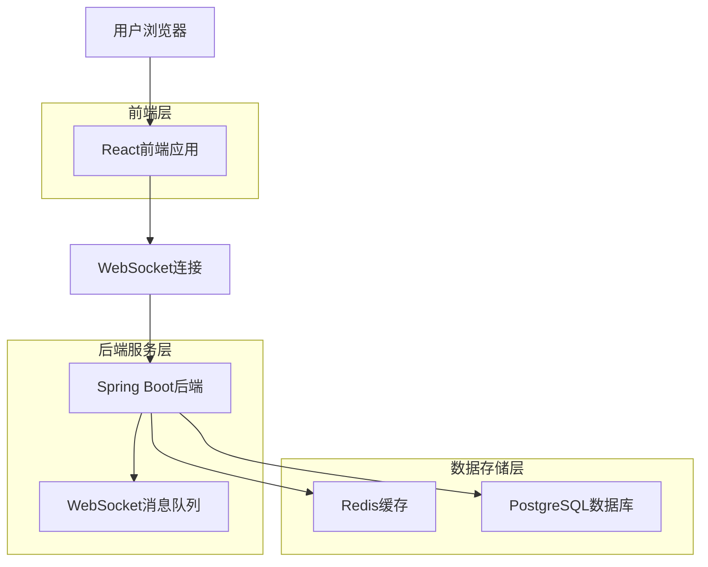
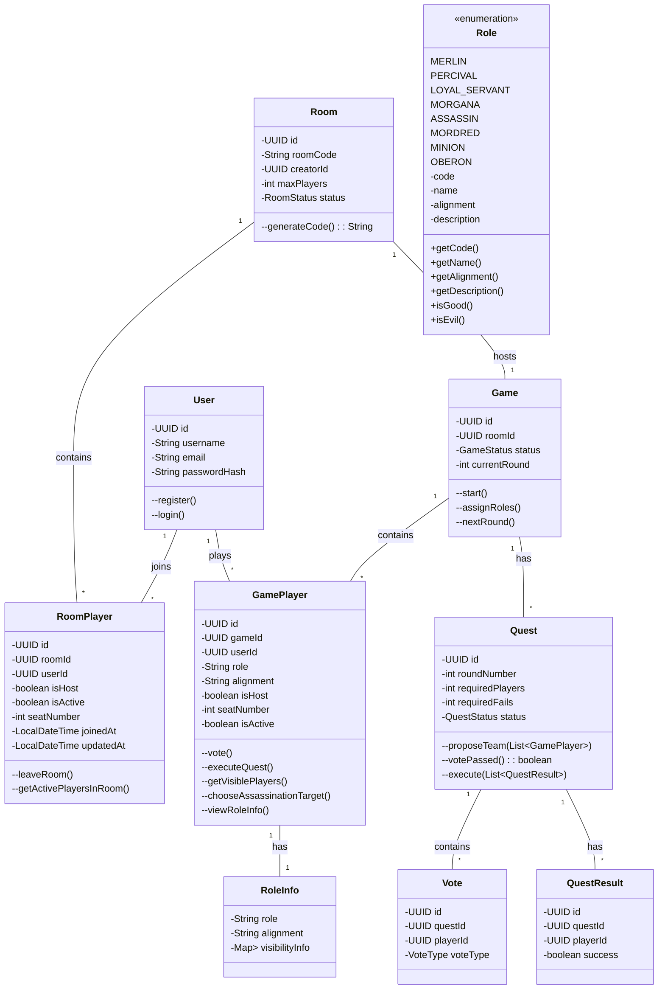
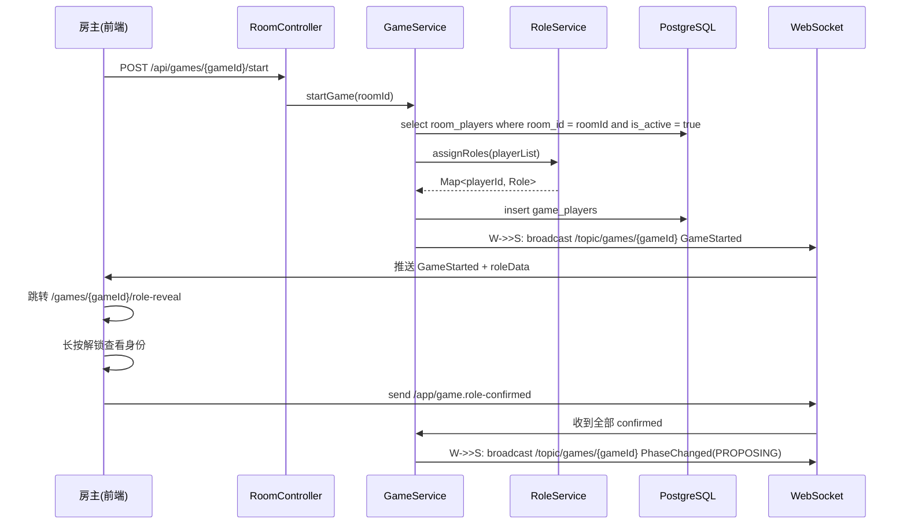
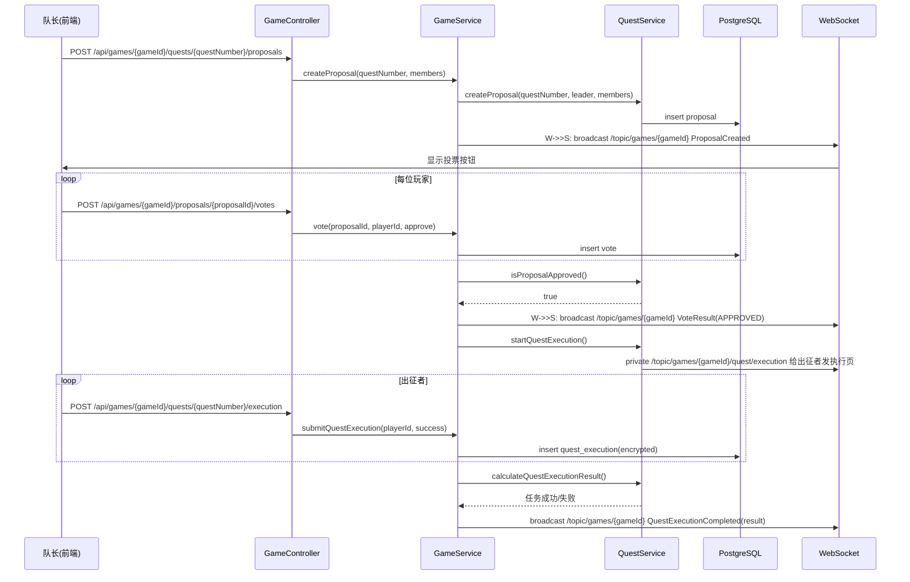
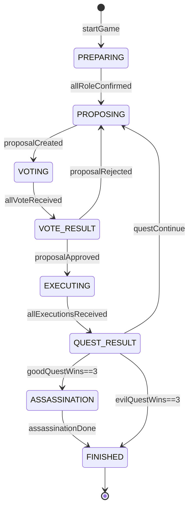

# 系统架构设计

## 1. 架构设计



## 2. 技术描述

* **前端**: React@18 + TypeScript + TailwindCSS + Vite

* **初始化工具**: vite-init

* **后端**: Spring Boot@3 + Java 17 + Maven

* **数据库**: PostgreSQL@15 + Redis@7

* **实时通信**: WebSocket + STOMP协议

* **认证授权**: Spring Security + JWT

## 3. 路由定义

| 路由        | 用途           |
|-----------|--------------|
| /         | 首页，游戏介绍和入口   |
| /rooms    | 房间页面，创建和加入房间 |
| /games    | 游戏页面，进行游戏    |
| /profile  | 个人中心，用户信息和历史 |
| /auth     | 认证授权页面       |

## 4. 设计模式应用

待办...

**原型模式（Prototype Pattern）**
用于角色创建和游戏配置，支持快速复制和定制化：

* `RolePrototype`: 角色原型管理

* `GameConfigPrototype`: 游戏配置原型

**观察者模式（Observer Pattern）**
用于游戏状态变更通知：

* `GameObserver`: 游戏状态观察者

* `WebSocketPublisher`: 实时消息推送

**策略模式（Strategy Pattern）**
用于不同的胜利条件判断：

* `VictoryConditionStrategy`: 胜利条件策略

* `QuestVictoryStrategy`: 任务胜利策略

* `AssassinationVictoryStrategy`: 刺杀胜利策略

***

## 5. 面向对象分析

### 5.1 核心类设计

**Game类（游戏核心）**

职能：一局游戏的"状态机 + 规则引擎"。

* 保存整局元数据（id、房间、当前轮次、状态机阶段）
* 负责阶段推进、角色分配、胜负判定、并发写保护（事务）

```java
public class Game {
    private UUID id;               // 局唯一标识
    private Room room;             // 所属房间
    private GameStatus status;     // 当前阶段（PREPARING / PROPOSING / VOTING ...）
    private int currentQuest;      // 第几轮任务（1-5）
    private List<GamePlayer> players; // 座位列表（含角色）
    private List<Quest> quests;    // 每轮任务快照，用于复盘
    private GameConfig config;   // 角色配置、最大人数等

    /**
     * 房主调用：把房间状态改为 PREPARING，分配角色，推送 WebSocket 事件
     */
    public void startGame();

    /**
     * 根据 config 把角色随机发到玩家，同时写入可见性缓存（Role#getVisiblePlayers）
     */
    public void assignRoles();

    /**
     * 收集完所有玩家投票后触发：
     * - 计算通过/否决
     * - 若通过→EXECUTING，给出征者推送执行页
     * - 若否决→PROPOSING，轮次+1，换队长
     * - 连续否决5次直接判邪恶胜利
     */
    public void processProposalVote(Proposal proposal);

    /**
     * 出征者全部提交任务卡后调用：
     * - 按规则计算成败（需至少1张失败即失败，第4轮需2张失败才失败）
     * - 更新好人/坏人任务胜利计数
     * - 进入 QUEST_RESULT 并广播结果
     */
    public void calculateQuestResult(Quest quest);

    /**
     * 好人3任务胜→进入 ASSASSINATION；
     * 坏人3任务胜→直接 FINISHED 邪恶胜利；
     * 刺杀完成→根据是否命中 Merlin 决定最终阵营胜利
     */
    public GameResult calculateFinalResult(Assassination assassination);
}
```

**RoomPlayer类（房间玩家）**

职能：表示用户在房间中的状态和会话信息。

* 负责跟踪用户何时加入房间、座位号、主机状态等

```java
public class RoomPlayer {
    private UUID id;               // 房间玩家唯一标识
    private Room room;             // 关联房间
    private User user;             // 关联用户
    private boolean isHost;        // 是否为房主
    private boolean isActive;      // 是否活跃（未离开房间）
    private int seatNumber;        // 座位序号
    private LocalDateTime joinedAt; // 加入时间
    private LocalDateTime updatedAt; // 更新时间
}
```

**GamePlayer类（游戏内玩家）**

职能：表示用户在游戏中的状态和游戏相关信息。
* 负责跟踪用户的游戏中角色、阵营、游戏内状态等信息
```java
public class GamePlayer {
    private UUID id;               // 游戏玩家唯一标识
    private Game game;             // 关联游戏
    private User user;             // 关联用户
    private String role;           // 分配到的角色（Merlin/Assassin...）
    private String alignment;      // 阵营（GOOD/EVIL）
    private boolean isHost;        // 是否为房主
    private int seatNumber;        // 座位序号
    private boolean isActive;      // 是否仍在局内

    /**
     * 对当前提案投票；写入 Vote 记录并触发 Game.processProposalVote
     */
    public Vote voteProposal(Proposal proposal, boolean approve);

    /**
     * 出征者匿名提交任务卡；仅当本玩家本轮在出征列表才可调用
     * @return true=任务成功，false=任务失败（由角色决定能否投失败）
     */
    public boolean submitQuestCard(boolean success);

    /**
     * 返回"我"能看到哪些其他玩家（基于角色枚举的可见性规则）
     */
    public List<GamePlayer> getVisiblePlayers();

    /**
     * 刺客阶段选择刺杀目标；写入 Assassination 记录
     */
    public Assassination chooseAssassinationTarget(GamePlayer target);

    /**
     * 查看角色信息
     */
    public RoleInfo viewRoleInfo();
}
```

**Role类（角色系统）**

职能：能把"看见谁"、"能否投失败卡"等**角色差异规则**封装成枚举，方便访问角色属性和规则。
* 使用枚举类型来定义所有可用角色，每个角色包含其基本属性和规则

```java
public enum Role {
    // 正义阵营
    MERLIN("merlin", "梅林", "正义", "你知道邪恶阵营的所有成员，除了莫德雷德"),
    PERCIVAL("percival", "派西维尔", "正义", "你知道梅林和莫甘娜，但不知道谁是谁"),
    LOYAL_SERVANT("loyal_servant", "亚瑟的忠臣", "正义", "你是忠诚的骑士，目标是完成神圣任务"),
    
    // 邪恶阵营
    MORGANA("morgana", "莫甘娜", "邪恶", "你出现在派西维尔的视野中，看起来像梅林"),
    ASSASSIN("assassin", "刺客", "邪恶", "游戏结束时，你可以尝试刺杀梅林"),
    MORDRED("mordred", "莫德雷德", "邪恶", "梅林不知道你的身份"),
    MINION("minion", "间谍", "邪恶", "你是邪恶阵营的普通成员"),
    OBERON("oberon", "奥伯伦", "邪恶", "其他邪恶成员不知道你的身份，你也不知道他们");

    private final String code;
    private final String name;
    private final String alignment;
    private final String description;
}
```

**Quest类（任务系统）**

职能：封装"一轮任务"的完整生命周期数据与规则。

* 保存队长、提案成员、投票记录、任务执行结果
* 提供"投票是否通过""任务成败判定"等无状态计算

```java
public class Quest {
    private UUID id;                       // 任务唯一标识
    private int questNumber;               // 第几轮任务（1-5）
    private int requiredPlayers;           // 本轮需要出征人数（依人数表）
    private int requiredFails;             // 本轮需几张"失败"才判任务失败（第4轮=2，其余=1）
    private QuestStatus status;          // 阶段：PROPOSED / VOTING / REJECTED / EXECUTED
    private GamePlayer leader;               // 本轮队长（提议者）
    private List<GamePlayer> proposedMembers; // 队长提交的出征名单（不可再改）
    private List<Vote> votes;              // 全体玩家投票记录（含赞成/反对）
    private List<QuestResult> executions; // 出征者匿名投的任务卡（success/fail）
    private QuestResult result;            // 最终成败（SUCCESS / FAIL / null）

    /**
     * 投票阶段结束调用：统计赞成/反对，达到半数以上赞成即通过
     * @return true 通过，false 否决
     */
    public boolean isProposalApproved();

    /**
     * 所有出征者提交任务卡后调用：
     * - 按 requiredFails 规则计算成败
     * - 写回 result 并改状态为 EXECUTED
     */
    public void calculateQuestResult();

    /**
     * 快速查询本轮任务最终成败；若未执行完返回 Optional.empty()
     */
    public Optional<QuestResult> getResult();

    /**
     * 复盘用：返回失败卡张数（用于前端展示"几张失败"）
     */
     public int getFailCardCount();
}
```

### 5.2 设计模式应用

待办...

**原型模式（Prototype Pattern）**
用于角色创建和游戏配置，支持快速复制和定制化：

* `RolePrototype`: 角色原型管理

* `GameConfigPrototype`: 游戏配置原型

**观察者模式（Observer Pattern）**
用于游戏状态变更通知：

* `GameObserver`: 游戏状态观察者

* `WebSocketPublisher`: 实时消息推送

**策略模式（Strategy Pattern）**
用于不同的胜利条件判断：

* `VictoryConditionStrategy`: 胜利条件策略

* `QuestVictoryStrategy`: 任务胜利策略

* `AssassinationVictoryStrategy`: 刺杀胜利策略

***

## 6. 面向对象建模

### 6.1 用例模型（Use-Case Model）

| 用例编号 | 用例名称  | 参与者 | 前置条件         | 典型流程（主干）                                         |
| ---- | ----- | --- | ------------ | ------------------------------------------------ |
| UC1  | 注册/登录 | 玩家  | 无            | 1. 输入用户名+密码2. 系统校验并返回JWT3. 进入首页                  |
| UC2  | 创建房间  | 玩家  | 已登录          | 1. 点击"创建房间"2. 设置人数（5-10）3. 系统生成roomCode并返回房间页    |
| UC3  | 加入房间  | 玩家  | 拥有有效roomCode | 1. 输入roomCode2. 系统校验房间状态waiting3. 进入房间页          |
| UC4  | 分配角色  | 系统  | 房主点击"开始游戏"   | 1. 系统按人数与配置随机分配角色2. 生成Game与GamePlayer记录3. 推送角色数据 |
| UC5  | 查看身份  | 玩家  | 角色已分配        | 1. 进入/role-reveal页2. 长按解锁查看身份与可见列表3. 倒计时结束自动遮罩   |
| UC6  | 提议队伍  | 队长  | 轮到该玩家当队长     | 1. 拖拽玩家头像到出征区2. 点击"确认提议"3. 系统进入投票阶段              |
| UC7  | 投票    | 玩家  | 处于投票阶段       | 1. 点击"赞成/反对"2. 系统实时更新投票计数                        |
| UC8  | 计算投票  | 系统  | 所有玩家完成投票     | 1. 若赞成>反对：任务进入执行阶段2. 否则轮次+1，换队长重新提议              |
| UC9  | 执行任务  | 出征者 | 投票通过且轮到出征    | 1. 出征者选择"成功/失败"暗扣2. 提交后系统加密存储结果                  |
| UC10 | 公布结果  | 系统  | 所有出征者已提交     | 1. 按规则计算是否失败2. 更新任务格颜色3. 推送下一阶段                  |
| UC11 | 刺杀    | 刺客  | 好人取得3次任务胜利   | 1. 刺客选择刺杀目标2. 系统验证是否为梅林3. 决定最终胜负                 |
| UC12 | 公布胜负  | 系统  | 刺杀完成或任务失败3次  | 1. 显示胜负海报2. 横向时间轴揭示全部身份3. 生成战绩卡片                 |

### 6.2 类模型（Class Model）



### 6.3 时序图（Sequence Diagram）

**场景 1：房主开始游戏 → 角色揭示**



**场景 2：队长提议队伍 → 投票 → 任务执行**



### 6.4 游戏阶段定义与流转

| 阶段代码          | 阶段名称 | 触发条件        | 前端页面         | 后端行为         |
| ------------- | ---- | ----------- | ------------ | ------------ |
| PREPARING     | 角色揭示 | 房主点击开始      | /role-reveal | 分配角色，推送角色数据  |
| PROPOSING     | 队长提议 | 上轮投票失败或新回合  | /game        | 标记当前队长，等待提议  |
| VOTING        | 全员投票 | 队长已提交名单     | /game        | 收集赞成/反对，实时计数 |
| VOTE_RESULT  | 投票结果 | 所有人已投票      | /game        | 计算通过/失败，推送结果 |
| EXECUTING     | 任务执行 | 投票通过        | /game        | 仅给出征者推送执行页   |
| QUEST_RESULT | 任务结果 | 出征者全部提交     | /game        | 解密计算成败，更新进度条 |
| ASSASSINATION | 刺杀   | 好人3次任务胜     | /game        | 仅刺客可见刺杀按钮    |
| FINISHED      | 终局结算 | 刺杀完成或坏人3任务胜 | /result      | 揭示身份，生成战绩卡片  |

> 阶段推进由后端 `GameStateMachine` 统一驱动，前端仅订阅 `PhaseChangedEvent` 并路由到对应子页面。

阶段流转图：



### 6.5 设计约束与约定

1. **可见性规则**由 `Role.getVisiblePlayers()` 统一封装，禁止在 UI 层硬编码角色列表。
2. **所有写操作**（投票、任务结果、刺杀）必须走数据库事务，防止并发重复提交。
3. **WebSocket 消息**按 `games/{gameId}` 分区，前端订阅 `/topic/games/{gameId}` 公共频道与 `/user/{userId}/games/{gameId}` 私有频道。
4. **roomCode** 仅用于外部输入/分享，内部一律使用 `roomId` 与 `gameId` 主键，避免主键遍历攻击。
5. **角色揭示页**数据一次性推送后前端本地保存，不再向后端请求，减少泄露面。

### 6.6 GamePlayer角色查看方法设计

**方法名**: `viewRoleInfo()`

**职责**: 当游戏开始后，允许GamePlayer查看自己的角色信息及相关可见信息

**实现细节**:

1. **角色信息获取**:
   - GamePlayer可以通过调用GameStateService的getGameState()方法获取自己的角色信息
   - 返回信息包括:
     * 自身角色名称 (role)
     * 所属阵营 (alignment)
     * 可见的其他玩家信息 (visibilityInfo)

2. **可见性信息处理**:
   - 使用RoleVisibilityService来计算当前玩家可以看到的其他玩家信息
   - 不同角色有不同的可见性规则:
     * 梅林(Merlin): 可以看到除莫德雷德外的所有邪恶阵营玩家
     * 派西维尔(Percival): 可以看到梅林和莫甘娜，但不知道具体谁是誰
     * 邪恶阵营(Evil): 可以看到其他邪恶阵营成员(奥伯伦除外)
     * 忠臣(Loyal Servant): 无特殊可见信息

3. **API接口设计**:
   - Endpoint: `GET /api/games/{gameId}/state`
   - 请求头需要包含JWT Token用于身份验证
   - 返回GameStateResponse对象，其中包含玩家的角色信息和可见性信息

4. **安全考虑**:
   - 只有游戏参与者才能查看自己的角色信息
   - 角色信息通过WebSocket在游戏开始时推送一次，之后通过API请求获取
   - 敏感信息(如其他玩家的真实角色)只提供给有权查看的玩家

5. **前端交互**:
   - 前端在游戏状态变为ROLE_VIEWING时，自动调用此方法获取角色信息
   - 角色揭示页显示玩家自己的角色和可见信息
   - 玩家确认查看角色后，可以继续游戏流程