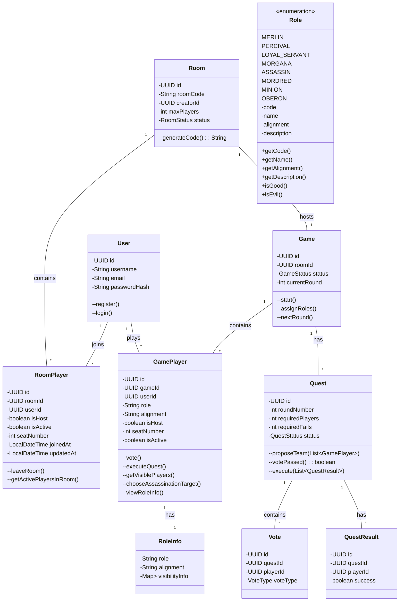
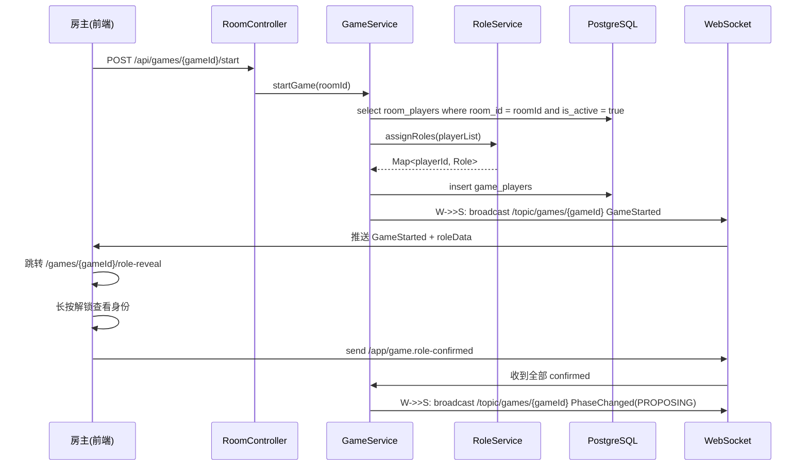
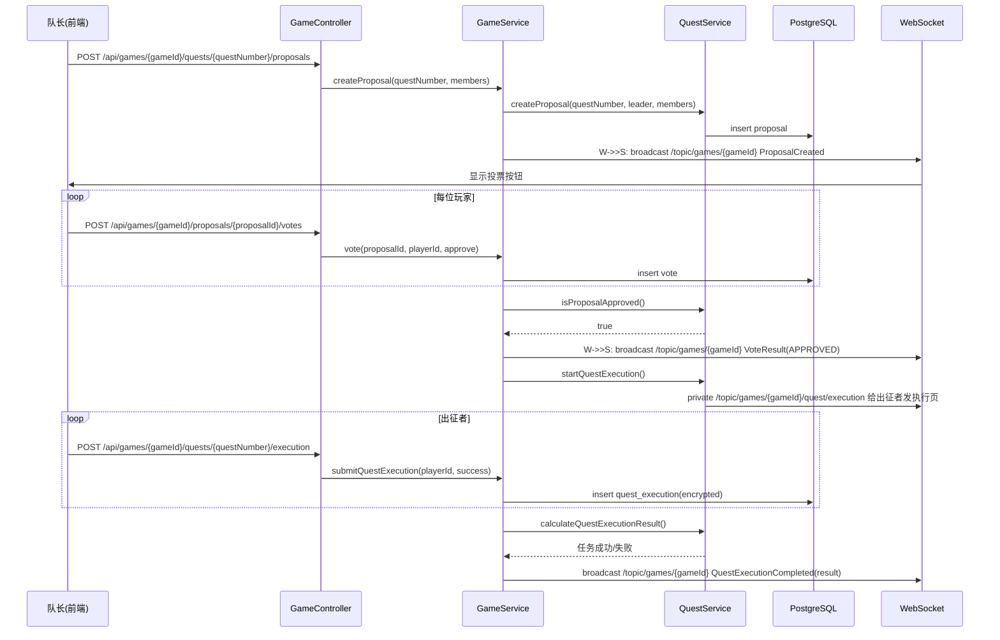
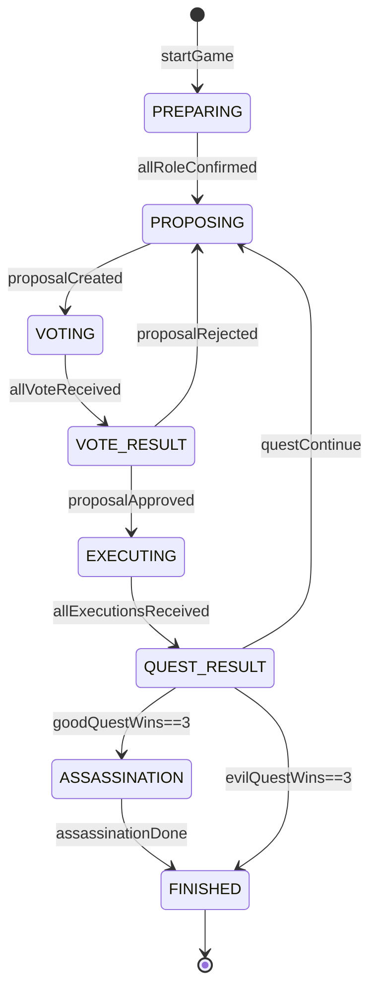

# 面向对象建模

## 1. 用例模型（Use-Case Model）

| 用例编号 | 用例名称  | 参与者 | 前置条件         | 典型流程（主干）                                         |
| ---- | ----- | --- | ------------ | ------------------------------------------------ |
| UC1  | 注册/登录 | 玩家  | 无            | 1. 输入用户名+密码2. 系统校验并返回JWT3. 进入首页                  |
| UC2  | 创建房间  | 玩家  | 已登录          | 1. 点击"创建房间"2. 设置人数（5-10）3. 系统生成roomCode并返回房间页    |
| UC3  | 加入房间  | 玩家  | 拥有有效roomCode | 1. 输入roomCode2. 系统校验房间状态waiting3. 进入房间页          |
| UC4  | 分配角色  | 系统  | 房主点击"开始游戏"   | 1. 系统按人数与配置随机分配角色2. 生成Game与GamePlayer记录3. 推送角色数据 |
| UC5  | 查看身份  | 玩家  | 角色已分配        | 1. 进入/role-reveal页2. 长按解锁查看身份与可见列表3. 倒计时结束自动遮罩   |
| UC6  | 提议队伍  | 队长  | 轮到该玩家当队长     | 1. 拖拽玩家头像到出征区2. 点击"确认提议"3. 系统进入投票阶段              |
| UC7  | 投票    | 玩家  | 处于投票阶段       | 1. 点击"赞成/反对"2. 系统实时更新投票计数                        |
| UC8  | 计算投票  | 系统  | 所有玩家完成投票     | 1. 若赞成>反对：任务进入执行阶段2. 否则轮次+1，换队长重新提议              |
| UC9  | 执行任务  | 出征者 | 投票通过且轮到出征    | 1. 出征者选择"成功/失败"暗扣2. 提交后系统加密存储结果                  |
| UC10 | 公布结果  | 系统  | 所有出征者已提交     | 1. 按规则计算是否失败2. 更新任务格颜色3. 推送下一阶段                  |
| UC11 | 刺杀    | 刺客  | 好人取得3次任务胜利   | 1. 刺客选择刺杀目标2. 系统验证是否为梅林3. 决定最终胜负                 |
| UC12 | 公布胜负  | 系统  | 刺杀完成或任务失败3次  | 1. 显示胜负海报2. 横向时间轴揭示全部身份3. 生成战绩卡片                 |

## 2. 类模型（Class Model）

## 3. 时序图（Sequence Diagram）

**场景 1：房主开始游戏 → 角色揭示**

**场景 2：队长提议队伍 → 投票 → 任务执行**

## 4. 游戏阶段定义与流转

| 阶段代码          | 阶段名称 | 触发条件        | 前端页面         | 后端行为         |
| ------------- | ---- | ----------- | ------------ | ------------ |
| PREPARING     | 角色揭示 | 房主点击开始      | /role-reveal | 分配角色，推送角色数据  |
| PROPOSING     | 队长提议 | 上轮投票失败或新回合  | /game        | 标记当前队长，等待提议  |
| VOTING        | 全员投票 | 队长已提交名单     | /game        | 收集赞成/反对，实时计数 |
| VOTE_RESULT  | 投票结果 | 所有人已投票      | /game        | 计算通过/失败，推送结果 |
| EXECUTING     | 任务执行 | 投票通过        | /game        | 仅给出征者推送执行页   |
| QUEST_RESULT | 任务结果 | 出征者全部提交     | /game        | 解密计算成败，更新进度条 |
| ASSASSINATION | 刺杀   | 好人3次任务胜     | /game        | 仅刺客可见刺杀按钮    |
| FINISHED      | 终局结算 | 刺杀完成或坏人3任务胜 | /result      | 揭示身份，生成战绩卡片  |

> 阶段推进由后端 `GameStateMachine` 统一驱动，前端仅订阅 `PhaseChangedEvent` 并路由到对应子页面。

阶段流转图：

## 5. 设计约束与约定

1. **可见性规则**由 `Role.getVisiblePlayers()` 统一封装，禁止在 UI 层硬编码角色列表。
2. **所有写操作**（投票、任务结果、刺杀）必须走数据库事务，防止并发重复提交。
3. **WebSocket 消息**按 `games/{gameId}` 分区，前端订阅 `/topic/games/{gameId}` 公共频道与 `/user/{userId}/games/{gameId}` 私有频道。
4. **roomCode** 仅用于外部输入/分享，内部一律使用 `roomId` 与 `gameId` 主键，避免主键遍历攻击。
5. **角色揭示页**数据一次性推送后前端本地保存，不再向后端请求，减少泄露面。