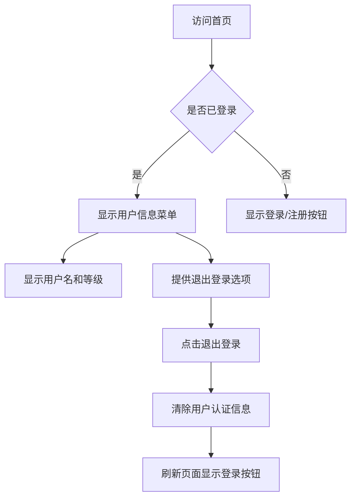
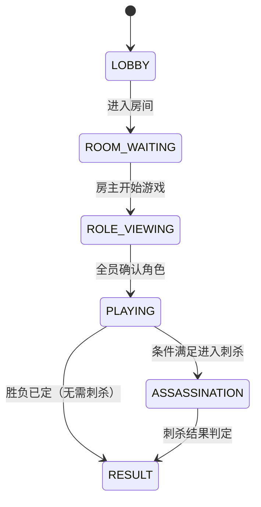

## 阿瓦隆，掌上桌游

阿瓦隆是一款多人身份推理桌游，玩家分为正义阵营和邪恶阵营，通过任务投票和身份推理来决定胜负。游戏核心围绕玩家身份（Role）、任务执行（Quest）和游戏进程（Game）展开。本项目采用原型模式进行迭代开发，支持多人在线游戏，提供完整的游戏体验，包括房间创建、玩家匹配、游戏进行、结果统计等功能。

**游戏方式说明**：所有发言、演讲与讨论环节均在线下进行，系统负责状态同步、角色可见性、投票与任务结果计算，不提供线上文字或语音聊天功能。

## TODO

* [x] 用户注册、登陆功能
* [x] 首页，信息展示，游戏开始按钮
* [x] 房间页面，加入房间、快速创建
* [x] 开始游戏，玩家获取角色和技能信息

### MVP 文档管理约定（简化）
- 仅维护两份文档：本 PRD 与 `docs/design_notes.md`
- PRD 定义范围与用例；设计笔记记录路由、状态机与最小 API
- 文档与代码同一次提交更新；无需额外层级与流程

## 一. 核心功能

### 1.1 用户角色

| 角色   | 注册方式      | 核心权限           |
| ---- | --------- | -------------- |
| 游客用户 | 无需注册，快速加入 | 加入房间，参与游戏      |
| 注册用户 | 账号密码注册    | 创建房间、加入房间，参与游戏 |

### 1.2 功能模块

阿瓦隆游戏系统一期（MVP）包含以下核心页面：

1. **首页**：游戏介绍、开始游戏、用户登陆信息。
2. **房间页面**：加入房间、创建房间。
3. **游戏页面**：玩家列表、玩家标识、房间人数、游戏开始按钮、退出房间按钮。
4. **角色揭示页**：角色、看到的信息。
5. **游戏进行页面**：挑选任务队员、投票、任务执行、刺杀、游戏状态等。
6. **结果页面**：胜负结果、角色揭示、基础战绩统计、用户信息显示。

### 1.3 页面详情

| 页面名称 | 模块名称   | 功能描述                 |
| ---- | ------ | -------------------- |
| 首页   | 导航栏    | 显示阿瓦隆图标，登陆/注册或登录用户信息 |
| 首页   | 开始游戏   | 开始游戏按钮，高亮显示          |
| 首页   | 游戏介绍   | 展示游戏规则、说明，新手教程       |
| 房间页面 | 加入房间   | 输入 Code加入房间          |
| 房间页面 | 创建房间   | 快速创建房间               |
| 游戏页面 | 玩家列表   | 房主标识，玩家标识，房间人数       |
| 游戏页面 | 开始游戏按钮 |                 |
| 游戏页面 | 退出房间按钮 |                 |
| 游戏页面 | 角色揭示页  | 角色及看到的信息             |

### 1.4 页面模块划分与用例

为便于实现与验收，各页面按模块与用例拆分如下（保持 MVP，避免过度细化）：

#### 首页（/home）

* 模块：导航栏、开始游戏、游戏介绍

* 主要用例：

  * 查看登录状态并展示用户信息或登录/注册入口

  * 点击“开始游戏”跳转房间页面

  * 查看新手教程与规则说明

* 验收标准：未登录显示登录入口；登录后显示用户名与等级；按钮显著可点击且跳转正确

#### 房间页面（/rooms）

* 模块：加入房间、创建房间、房间校验与提示

* 主要用例：

  * 输入房间码加入房间，失败时提示原因（不存在、已满、已开始等）

  * 快速创建房间并成为房主

* 权限：游客可加入；注册用户可创建；房主具备房间管理操作

* 验收标准：加入/创建均有可视化反馈；错误提示明确且可重试

#### 游戏页面（/games/{game\_id}）

* 模块：玩家列表（房主标识、队长标识）、房间信息、控制栏（开始/退出）

* 主要用例：

  * 房主点击开始游戏，广播状态到所有玩家

  * 玩家退出房间，人数与标识实时更新

* 状态映射：ROOM\_WAITING → ROLE\_VIEWING

* 验收标准：开始/退出操作可达且有实时反馈；标识与人数准确

#### 角色揭示页（/games/{game\_id}/role-reveal）

* 模块：基础信息、可见信息、提示区域、确认已查看

* 主要用例：

  * 查看角色名称与阵营、根据角色展示应见信息

  * 点击“我已查看”进入下一阶段（房主需等待全员确认）

* 验收标准：信息只对本人可见；确认状态可统计；全员确认后可进入 PLAYING

#### 游戏进行页面（/games/{game\_id}/playing）

* 模块：队伍提案、提案投票、任务执行、刺杀阶段（条件满足时）、状态展示

* 主要用例：

  * 当前队长提案队伍并提交；全员进行赞成/反对投票

  * 任务队员执行成功/失败操作；根据规则判定任务结果

  * 条件满足进入刺杀阶段，邪恶阵营进行刺杀尝试

* 状态映射：PLAYING 子阶段内流转；可能进入 ASSASSINATION 或 RESULT

* 验收标准：每步均有明确 UI 与结果广播；边界规则（如某回合需两张失败）正确处理

#### 结果页面（/games/{game\_id}/result）

* 模块：胜负结果、角色揭示、基础战绩统计、用户信息显示

* 主要用例：

  * 显示胜负与关键事件（任务结果、是否刺杀成功）

  * 展示所有玩家角色与阵营；统计基础战绩

* 验收标准：结果一致、统计准确、可返回房间或首页

## 二. 核心流程

### 2.1 用户认证流程

### 2.2 状态机与页面映射

系统状态自洽，页面与状态相互映射：

* 页面映射：

  * LOBBY → 首页 `/home`

  * ROOM\_WAITING → 游戏页面（等待开始）`/games/{game_id}`

  * ROLE\_VIEWING → 角色揭示页 `/games/{game_id}/role-reveal`

  * PLAYING → 游戏进行页面 `/games/{game_id}/playing`

  * ASSASSINATION → 刺杀阶段（进行页内子阶段）`/games/{game_id}/playing#assassination`

  * RESULT → 结果页面 `/games/{game_id}/result`

事件触发方：房主（开始游戏）、队长（队伍提案）、全员（投票）、任务队员（执行结果）、邪恶阵营（刺杀）。

### 2.4 路由约定与深链

* 路径前缀：`/games/{game_id}`，`{game_id}` 为后端生成的唯一标识。

* 访问校验：当 `game_id` 不存在或用户无权限时，重定向至 `/rooms` 或 `/home` 并提示原因。

* 深链支持：允许直接访问子路径（如 `/games/{game_id}/role-reveal`），前端根据服务端状态进行纠偏与引导。

* 刷新行为：保留当前游戏状态；客户端加载时使用 `game_id` 拉取最新状态并恢复 UI。

### 2.3 异常与恢复策略（摘要）

* 网络中断：前端状态保持只读，重连后进行状态对齐；关键操作需服务器确认

* 房间解散：广播解散并回到首页；显示原因与操作人

* 玩家掉线：记入玩家状态，若为队长则指派下一位或等待重连

## 四. 权限与可见性矩阵

| 身份/角色 | 可见性          | 允许操作         | 适用页面      |
| ----- | ------------ | ------------ | --------- |
| 游客    | 基础房间信息       | 加入房间         | 首页、房间页面   |
| 注册用户  | 同上           | 创建房间、加入房间    | 首页、房间页面   |
| 房主    | 全员列表、房主标识    | 开始游戏、踢人、解散房间 | 游戏页面、进行页  |
| 队长    | 当前回合相关信息     | 提案队伍         | 进行页       |
| 梅林    | 邪恶视野（排除莫德雷德） | 无            | 角色揭示页、进行页 |
| 派西维尔  | 梅林/莫甘娜模糊视野   | 无            | 角色揭示页、进行页 |
| 邪恶阵营  | 邪恶互知（奥伯伦例外）  | 任务中可失败、刺杀    | 角色揭示页、进行页 |

可见信息仅在角色揭示与进行阶段对本人显示；任何越权访问均需服务端校验与拒绝。

## 五. 用例模板与验收标准

为统一描述，每模块用例按以下模板撰写：

* 背景与目标：该模块解决的用户与系统目标

* 前置条件：登录状态、房间存在性、角色/权限、当前状态

* 主流程：3–7 步的核心交互，保持可执行性

* 状态与数据：输入/输出字段、事件、实时性要求

* 权限与可见性：谁可见、谁可操作

* 异常与空态：网络断开、房间满员、投票未完成等

* 验收标准：可视反馈、边界处理、日志可追踪、性能指标

## 三. 角色揭示页设计

### 3.1 设计理念

当房主点击开始游戏后，系统会为所有玩家随机分配角色。此时进入"角色查看阶段"（ROLE\_VIEWING），所有玩家可以查看自己的角色信息和特殊能力。

### 3.2 角色揭示页内容结构

#### 基础信息

**角色名称**：玩家被分配的角色（如"梅林"、"刺客"等），并标识阵营。

#### 可见信息

根据角色类型，显示该角色能看到的其他玩家信息

* 梅林：显示所有邪恶阵营玩家（除莫德雷德）

* 派西维尔：显示梅林和莫甘娜（但不知道具体谁是谁）

* 邪恶阵营：显示其他邪恶阵营成员

* 忠臣：无特殊视野信息

#### 游戏提示区域

* **游戏目标**：根据阵营说明胜利条件

* **注意事项**：提醒玩家线下讨论时需要注意的事项

* **下一步操作**：提示玩家等待房主开始第一个任务

### 3.3 不同角色的可见性信息

#### 正义阵营角色

1. **梅林（Merlin）**

   * 可见信息：所有邪恶阵营玩家（除莫德雷德）

   * 能力描述：你知道邪恶阵营的所有成员，除了莫德雷德。小心隐藏自己的身份！

2. **派西维尔（Percival）**

   * 可见信息：梅林和莫甘娜（但不知道具体谁是谁）

   * 能力描述：你知道梅林和莫甘娜，但不知道谁是谁。需要仔细观察才能辨别真伪。

3. **亚瑟的忠臣（Loyal Servant）**

   * 可见信息：无特殊视野

   * 能力描述：你是忠诚的骑士，目标是完成神圣任务。相信你的队友！

#### 邪恶阵营角色

1. **刺客（Assassin）**

   * 可见信息：所有邪恶阵营成员（除奥伯伦）

   * 能力描述：你是邪恶阵营的领导者。游戏结束时，你可以尝试刺杀梅林。

2. **莫甘娜（Morgana）**

   * 可见信息：所有邪恶阵营成员（除奥伯伦）

   * 能力描述：你出现在派西维尔的视野中，看起来像梅林。误导正义阵营！

3. **莫德雷德（Mordred）**

   * 可见信息：其他邪恶阵营成员（除奥伯伦和自己）

   * 能力描述：梅林不知道你的身份。隐藏在暗影中破坏正义的计划。

4. **间谍（Minion）**

   * 可见信息：所有邪恶阵营成员（除奥伯伦）

   * 能力描述：你是邪恶阵营的普通成员。协助你的队友获得胜利。

5. **奥伯伦（Oberon）**

   * 可见信息：无邪恶阵营信息

   * 能力描述：其他邪恶成员不知道你的身份，你也不知道他们。独立行动！

### 3.4 技术实现要点

1. **数据安全**：确保每个玩家只能看到自己的角色信息和该角色应有的可见信息
2. **实时同步**：当所有玩家都查看完角色后，房主可以点击开始第一个任务
3. **状态管理**：游戏状态从ROLE\_VIEWING转换为PLAYING
4. **WebSocket通知**：当房主开始第一个任务时，所有玩家实时收到状态更新
